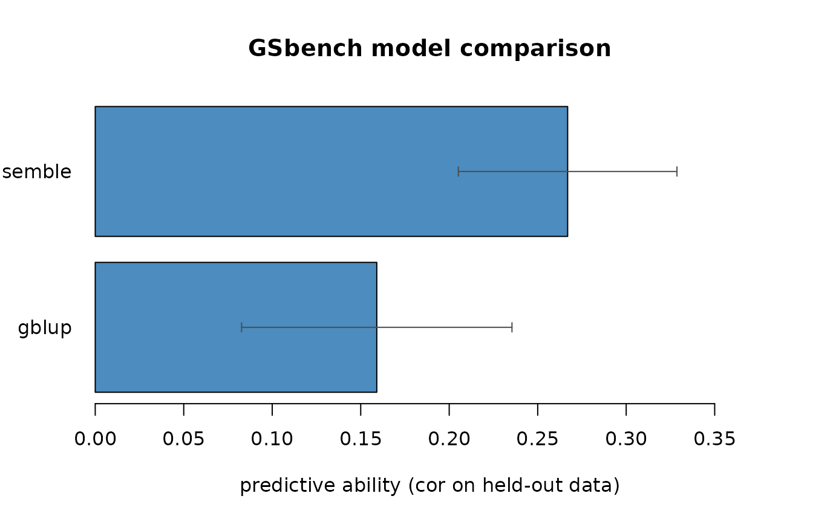

# Benchmarking genomic prediction models with GSbench

GSbench fits and compares genomic-selection models — GBLUP, ridge marker
effects, and machine-learning methods — through one interface, using
breeding-relevant cross-validation. This vignette walks through a full
workflow.

``` r

library(GSbench)
```

## A simulated dataset

For a reproducible example we simulate a population: 300 lines, 2000
SNPs, 50 QTL, narrow-sense heritability 0.5.

``` r

sim <- simulate_population(n = 300, m = 2000, n_qtl = 50, h2 = 0.5, seed = 1)
dim(sim$geno)
#> [1]  300 2000
sim$h2          # realised heritability
#> [1] 0.5
```

## Quality control

Filter low-call-rate, low-MAF and monomorphic markers, and impute the
rest.

``` r

qc <- qc_markers(sim$geno, maf = 0.05, max_missing = 0.1)
qc$removed
#>   call_rate         maf monomorphic 
#>           0          19           0
geno <- qc$geno
```

## GBLUP and the genomic relationship matrix

[`gblup()`](https://mqfarooqi1.github.io/GSbench/reference/gblup.md)
estimates variance components by REML. (Its GEBVs match
[`rrBLUP::mixed.solve`](https://rdrr.io/pkg/rrBLUP/man/mixed.solve.html)
to within `6e-5` — see the package tests.)

``` r

fit <- gblup(sim$pheno, geno)
fit
#> <gblup>
#>   Vu = 50.27, Ve = 37.31, h2 = 0.574
#>   300 individuals; intercept = -0.4076; marker effects available
cor(fit$gebv, sim$bv)     # accuracy against the true breeding values
#> [1] 0.6941135
```

Because `geno` was supplied, the fit also carries ridge marker effects,
so it can predict new genotypes:

``` r

train <- 1:240; test <- 241:300
fit_tr <- gs_fit(sim$pheno[train], geno[train, ], model = "gblup")
pred   <- predict(fit_tr, geno[test, ])
cor(pred, sim$bv[test])
#> [1] 0.2115857
```

## One interface for many models

[`gs_fit()`](https://mqfarooqi1.github.io/GSbench/reference/gs_fit.md)
exposes the same API for every model family. Which are available depends
on which optional packages you have installed:

``` r

available_models()
#> [1] "gblup"         "elastic_net"   "random_forest" "xgboost"      
#> [5] "ensemble"
```

``` r

en <- gs_fit(sim$pheno[train], geno[train, ], model = "elastic_net")
cor(predict(en, geno[test, ]), sim$bv[test])
#> [1] 0.4801127
```

## Cross-validation, done correctly

[`gs_cv()`](https://mqfarooqi1.github.io/GSbench/reference/gs_cv.md)
runs breeding-relevant cross-validation. Random k-fold predicts untested
lines (CV1); `leave_group_out` holds out whole families or environments.

``` r

cv <- gs_cv(sim$pheno, geno, models = "gblup", k = 5, reps = 1, seed = 1)
cv
#> <gs_cv: kfold>
#>   5-fold x 1 rep(s)
#>  model  mean    sd n_folds
#>  gblup 0.159 0.076       5
#>   (accuracy = predictive ability, cor(pred, observed) on held-out data)

# leave-one-family-out, with a toy family structure
fam <- rep(1:6, length.out = nrow(geno))
gs_cv(sim$pheno, geno, models = "gblup",
      scheme = "leave_group_out", groups = fam)
#> <gs_cv: leave_group_out>
#>  model  mean    sd n_folds
#>  gblup 0.196 0.166       6
#>   (accuracy = predictive ability, cor(pred, observed) on held-out data)
```

## A stacked ensemble

[`gs_ensemble()`](https://mqfarooqi1.github.io/GSbench/reference/gs_ensemble.md)
combines base models into a super-learner: each model’s out-of-fold
predictions are used to learn non-negative weights (summing to one), and
the final predictor is that weighted blend.

``` r

ens <- gs_ensemble(sim$pheno, geno, base_models = "gblup", seed = 1)
ens$weights
#> gblup 
#>     1
```

With several base models installed, the weights show how much each
contributes.

## Benchmarking everything at once

[`gs_benchmark()`](https://mqfarooqi1.github.io/GSbench/reference/gs_benchmark.md)
runs every available model — including the ensemble — under one
cross-validation and reports predictive ability so you can compare them
fairly.

``` r

bench <- gs_benchmark(sim$pheno, geno, models = c("gblup", "ensemble"),
                      k = 5, seed = 1)
bench$accuracy
#>      model      mean         sd n_folds
#> 1 ensemble 0.2669233 0.06176019       5
#> 2    gblup 0.1590768 0.07638873       5
```

``` r

plot(bench)
```



For an additive trait like this one, GBLUP and elastic net are typically
strongest; tree methods trail; the ensemble lands near the top without
you having to pick the winner in advance.
